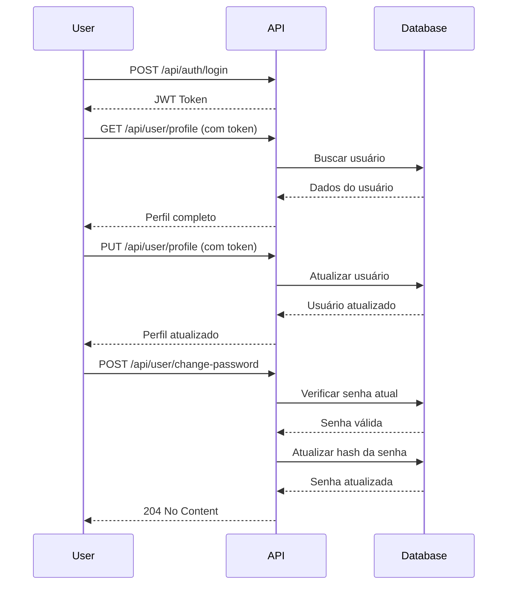

# 👤 User Account Management - Financial Manager API

## 📋 Visão Geral

Endpoints para gerenciamento de perfil do usuário autenticado.

## 🔐 Autenticação Necessária

Todos os endpoints requerem um token JWT válido no header:
```
Authorization: Bearer {token}
```

---

## 📝 Endpoints

### **1. GET /api/user/profile**
Obtém as informações do perfil do usuário autenticado.

#### **Request**
```http
GET https://localhost:5001/api/user/profile
Authorization: Bearer {token}
```

#### **Response (200 OK)**
```json
{
  "id": "75c8ecaa-3f29-4dba-8f5d-1c4260df576a",
  "name": "Maria Silva",
  "email": "maria@email.com",
  "createdAt": "2024-01-10T10:00:00Z",
  "lastLoginAt": "2024-01-15T14:30:00Z",
  "isActive": true,
  "accountsCount": 3
}
```

---

### **2. PUT /api/user/profile**
Atualiza o nome e/ou email do usuário.

#### **Request**
```http
PUT https://localhost:5001/api/user/profile
Authorization: Bearer {token}
Content-Type: application/json

{
  "name": "Maria Silva Santos",
  "email": "maria.santos@email.com"
}
```

#### **Response (200 OK)**
```json
{
  "id": "75c8ecaa-3f29-4dba-8f5d-1c4260df576a",
  "name": "Maria Silva Santos",
  "email": "maria.santos@email.com",
  "createdAt": "2024-01-10T10:00:00Z",
  "lastLoginAt": "2024-01-15T14:30:00Z",
  "isActive": true,
  "accountsCount": 3
}
```

#### **Validações**
- ✅ Nome é obrigatório (máx. 100 caracteres)
- ✅ Email é obrigatório e deve ser válido (máx. 150 caracteres)
- ✅ Email não pode estar em uso por outro usuário

#### **Erros Possíveis**
**400 Bad Request** - Validação falhou
```json
{
  "error": "Ocorreram um ou mais erros de validação.",
  "errors": {
    "Email": ["Email inválido"]
  },
  "statusCode": 400,
  "type": "Validation"
}
```

**400 Bad Request** - Email já em uso
```json
{
  "error": "Email já está em uso por outro usuário",
  "statusCode": 400,
  "type": "BusinessRule"
}
```

---

### **3. POST /api/user/change-password**
Altera a senha do usuário.

#### **Request**
```http
POST https://localhost:5001/api/user/change-password
Authorization: Bearer {token}
Content-Type: application/json

{
  "currentPassword": "SenhaAtual123",
  "newPassword": "NovaSenha456",
  "confirmNewPassword": "NovaSenha456"
}
```

#### **Response (204 No Content)**
Sucesso - sem corpo de resposta.

#### **Validações**
- ✅ Senha atual é obrigatória
- ✅ Nova senha é obrigatória (mín. 6 caracteres, máx. 100)
- ✅ Confirmação de senha deve ser igual à nova senha
- ✅ Senha atual deve estar correta

#### **Erros Possíveis**
**400 Bad Request** - Senhas não conferem
```json
{
  "error": "Ocorreram um ou mais erros de validação.",
  "errors": {
    "ConfirmNewPassword": ["As senhas não conferem"]
  },
  "statusCode": 400,
  "type": "Validation"
}
```

**401 Unauthorized** - Senha atual incorreta
```json
{
  "error": "Senha atual incorreta",
  "statusCode": 401,
  "type": "Unauthorized"
}
```

---

### **4. DELETE /api/user/deactivate**
Desativa a conta do usuário. O usuário não poderá mais fazer login.

⚠️ **ATENÇÃO**: Esta ação desativa a conta permanentemente. O usuário não poderá mais acessar o sistema.

#### **Request**
```http
DELETE https://localhost:5001/api/user/deactivate
Authorization: Bearer {token}
```

#### **Response (204 No Content)**
Sucesso - conta desativada.

---

## 🧪 Exemplos de Uso

### **JavaScript/Fetch**

```javascript
// Obter perfil
async function getProfile(token) {
  const response = await fetch('https://localhost:5001/api/user/profile', {
    headers: { 
      'Authorization': `Bearer ${token}`
    }
  });
  return response.json();
}

// Atualizar perfil
async function updateProfile(token, name, email) {
  const response = await fetch('https://localhost:5001/api/user/profile', {
    method: 'PUT',
    headers: {
      'Authorization': `Bearer ${token}`,
      'Content-Type': 'application/json'
    },
    body: JSON.stringify({ name, email })
  });
  return response.json();
}

// Mudar senha
async function changePassword(token, currentPassword, newPassword, confirmNewPassword) {
  const response = await fetch('https://localhost:5001/api/user/change-password', {
    method: 'POST',
    headers: {
      'Authorization': `Bearer ${token}`,
      'Content-Type': 'application/json'
    },
    body: JSON.stringify({ currentPassword, newPassword, confirmNewPassword })
  });
  
  if (response.ok) {
    console.log('Senha alterada com sucesso!');
  }
}

// Desativar conta
async function deactivateAccount(token) {
  const response = await fetch('https://localhost:5001/api/user/deactivate', {
    method: 'DELETE',
    headers: {
      'Authorization': `Bearer ${token}`
    }
  });
  
  if (response.ok) {
    console.log('Conta desativada com sucesso!');
  }
}
```

---

### **C# / HttpClient**

```csharp
public class UserProfileClient
{
    private readonly HttpClient _client;
    private readonly string _token;

    public UserProfileClient(HttpClient client, string token)
    {
        _client = client;
        _token = token;
        _client.DefaultRequestHeaders.Authorization = 
            new AuthenticationHeaderValue("Bearer", token);
    }

    public async Task<UserProfileResponse> GetProfileAsync()
    {
        var response = await _client.GetAsync("/api/user/profile");
        response.EnsureSuccessStatusCode();
        return await response.Content.ReadFromJsonAsync<UserProfileResponse>();
    }

    public async Task<UserProfileResponse> UpdateProfileAsync(string name, string email)
    {
        var request = new { name, email };
        var response = await _client.PutAsJsonAsync("/api/user/profile", request);
        response.EnsureSuccessStatusCode();
        return await response.Content.ReadFromJsonAsync<UserProfileResponse>();
    }

    public async Task ChangePasswordAsync(string currentPassword, string newPassword)
    {
        var request = new 
        { 
            currentPassword, 
            newPassword, 
            confirmNewPassword = newPassword 
        };
        var response = await _client.PostAsJsonAsync("/api/user/change-password", request);
        response.EnsureSuccessStatusCode();
    }

    public async Task DeactivateAccountAsync()
    {
        var response = await _client.DeleteAsync("/api/user/deactivate");
        response.EnsureSuccessStatusCode();
    }
}
```

---

### **cURL**

```bash
# Obter perfil
curl -X GET "https://localhost:5001/api/user/profile" \
  -H "Authorization: Bearer {token}"

# Atualizar perfil
curl -X PUT "https://localhost:5001/api/user/profile" \
  -H "Authorization: Bearer {token}" \
  -H "Content-Type: application/json" \
  -d '{"name":"Novo Nome","email":"novo@email.com"}'

# Mudar senha
curl -X POST "https://localhost:5001/api/user/change-password" \
  -H "Authorization: Bearer {token}" \
  -H "Content-Type: application/json" \
  -d '{"currentPassword":"Atual123","newPassword":"Nova456","confirmNewPassword":"Nova456"}'

# Desativar conta
curl -X DELETE "https://localhost:5001/api/user/deactivate" \
  -H "Authorization: Bearer {token}"
```

---

## 🔒 Segurança

### **Validação de Senha**
- ✅ BCrypt para verificação
- ✅ Proteção contra timing attacks
- ✅ Senha atual obrigatória antes de mudar

### **Email Único**
- ✅ Verificação de email duplicado
- ✅ Case-insensitive (convertido para lowercase)

### **Desativação de Conta**
- ⚠️ Ação irreversível (via API)
- ✅ Impede novos logins
- ✅ Dados preservados no banco

---

## 🎯 Fluxo Completo de Uso



---

## ✅ Casos de Teste

### **Teste 1: Obter Perfil**
```
1. Fazer login
2. Copiar token
3. GET /api/user/profile
4. ✅ Deve retornar dados do usuário
```

### **Teste 2: Atualizar Perfil com Email Válido**
```
1. PUT /api/user/profile com novo email
2. ✅ Deve atualizar com sucesso
```

### **Teste 3: Atualizar com Email Duplicado**
```
1. Criar usuário A com email "user1@test.com"
2. Criar usuário B com email "user2@test.com"
3. Tentar atualizar B para "user1@test.com"
4. ❌ Deve retornar 400 - Email já em uso
```

### **Teste 4: Mudar Senha com Senha Errada**
```
1. POST /api/user/change-password com senha atual errada
2. ❌ Deve retornar 401 - Senha atual incorreta
```

### **Teste 5: Mudar Senha com Confirmação Diferente**
```
1. POST /api/user/change-password
2. newPassword: "Nova123"
3. confirmNewPassword: "Nova456"
4. ❌ Deve retornar 400 - Senhas não conferem
```

### **Teste 6: Desativar Conta**
```
1. DELETE /api/user/deactivate
2. ✅ Conta desativada
3. Tentar fazer login novamente
4. ❌ Deve retornar 401 - Usuário inativo
```

---

## 📊 Resumo dos Endpoints

| Método | Endpoint                   | Descrição              | Auth |
|--------|----------------------------|------------------------|------|
| GET    | /api/user/profile          | Obter perfil           | ✅   |
| PUT    | /api/user/profile          | Atualizar perfil       | ✅   |
| POST   | /api/user/change-password  | Mudar senha            | ✅   |
| DELETE | /api/user/deactivate       | Desativar conta        | ✅   |

---

**✅ User Account Management implementado com sucesso!** 👤
